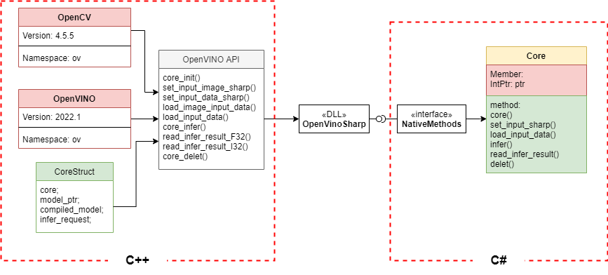

# C#调用OpenVINO™部署Al模型项目开发
## 简介

C#调用OpenVINO™部署Al模型项目开发项目，简称OpenVinoSharp，这是一个示例项目，该项目实现在C#编程语言下调用Intel推出的 OpenVINO™ 工具套件，进行深度学习等Al项目在C#框架下的部署。该项目由C++语言编写OpenVINO™ API接口，并在C#语言下实现应用。

## 项目功能

项目可以实现在C#编程语言下调用Intel推出的 OpenVINO™ 工具套件，进行深度学习等Al项目在C#框架下的部署，目前可以支持的Al模型格式：

- Paddlepaddle 飞桨模型 (.pdmodel)
- ONNX 开放式神经网络交换模型 (.onnx)

- IR 模型 (.xml, .bin)

目前该项目针对 Paddlepaddle 飞桨现有模型进行了测试，主要有：

- PaddleClas 飞桨图像识别套件
- PaddleDetection 目标检测模型套件

针对 PaddleClas 、PaddleDetection ，该项目分别使用了飞桨提供的花卉分类模型以及车辆检测模型进行了测试，实现了该模型在三种格式下从模型本地读取、推理数据加载、模型推理、推理结果读取以及推理数据处理一整套Al模型的应用实现。

## 项目方案



该项目通过C++调用OpenVINO™ 工具套件

## 项目文档

想要更详细的了解该项目，请参阅[C#调用OpenVINOTM部署Al模型项目开发](./doc/C#调用OpenVINOTM部署Al模型项目开发.docx)

## 使用环境

**系统平台：**

​			Windows

**软件要求：**

​			Visual Studio 2022 / 2019 / 2017

​			OpenCV 4.5.5

​			OpenVINO 2022.1

## 下载

**在Github上克隆下载：**

```shell
git clone https://github.com/guojin-yan/OpenVinoSharp.git
```

**在Ditee上克隆下载：**

```shell
git clone https://gitee.com/guojin-yan/OpenVinoSharp.git
```

