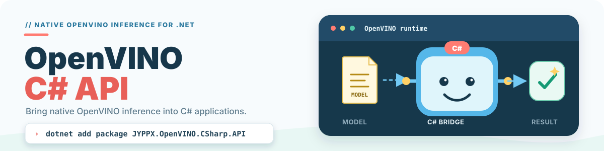

<picture>
  <source media="(prefers-color-scheme: dark)" srcset="docs/images/readme/hero-dark.svg">
  <source media="(prefers-color-scheme: light)" srcset="docs/images/readme/hero-light.svg">
  
</picture>

# OpenVINO C# API

[](https://github.com/guojin-yan/OpenVINO-CSharp-API/blob/csharp3.3/LICENSE.txt)
[](https://www.nuget.org/packages/JYPPX.OpenVINO.CSharp.API/)
[](https://www.nuget.org/packages/JYPPX.OpenVINO.CSharp.API/)
[](https://github.com/guojin-yan/OpenVINO-CSharp-API/actions/workflows/build.yml)
[](https://github.com/guojin-yan/OpenVINO-CSharp-API/stargazers)
[](https://dotnet.microsoft.com/)
[](https://www.intel.com/content/www/us/en/developer/tools/openvino-toolkit/overview.html)

English | [简体中文](README.md)

Intel Distribution [OpenVINO™](https://www.intel.com/content/www/us/en/developer/tools/openvino-toolkit/overview.html) tool suite is developed based on oneAPI and can accelerate the development of high-performance computer vision and deep learning applications. It is suitable for various Intel platforms from the edge to the cloud, helping users deploy more accurate real-world results to production systems faster. By simplifying the development workflow, OpenVINO™ empowers developers to deploy high-performance applications and algorithms in the real world.

**OpenVINO C# API is a .NET wrapper library for Intel OpenVINO, enabling C# developers to run deep learning model inference with high performance on Windows, Linux, and macOS. Supports mainstream models like YOLO, ResNet, BERT, etc.**

The current stable version is **OpenVINO™ C# API 3.3.1**, paired with the OpenVINO 2026.3 runtime.

## 📢 3.3.1 Update Summary

- Aligns with OpenVINO Core 2026.3 while keeping existing Core inference APIs compatible.
- Provides optional `OpenVinoSharp.GenAI` wrappers for LLM, Whisper, and VLM scenarios.
- Uses `ChatHistory` and `GenerateWithHistory()` for multi-turn VLM conversations.
- Provides matching OpenVINO 2026.3 Core and GenAI runtime packages for Windows, Linux, and macOS.

[Read the complete 3.3.1 release notes](https://github.com/guojin-yan/OpenVINO-CSharp-API/blob/csharp3.3/docs/release-notes/3.3.1.md) · [Browse all releases](https://github.com/guojin-yan/OpenVINO-CSharp-API/tree/csharp3.3/docs/release-notes)

Finally, if you have any questions during use, you can communicate and contact me. We also welcome C# developers to join OpenVINO™ C# API development.

```
┌─────────────────────────────────────────────────────────────────────────┐
│  One Sentence Summary                                                    │
│  ─────────────────────────────────────────────────────────────────────  │
│  Run AI model inference in C#, cross-platform, high-performance,         │
│  supporting .NET 4.6 to .NET 10.0                                        │
├─────────────────────────────────────────────────────────────────────────┤
│  Four Core Advantages                                                    │
│  ─────────────────────────────────────────────────────────────────────  │
│  🚀 High Performance  │  Span<T> zero-copy memory, speed rivals Python/C++│
│  🖥️ Cross-Platform    │  Windows/Linux/macOS, x64/ARM64 full support     │
│  🔄 Async Support     │  async/await async inference for high concurrency│
│  🔌 Multi-Device      │  Intel CPU/iGPU/GPU/NPU, AMD CPU (partial)       │
├─────────────────────────────────────────────────────────────────────────┤
│  Use Cases                                                               │
│  ─────────────────────────────────────────────────────────────────────  │
│  Object Detection(YOLO) │ Image Classification │ OCR │ Face Recognition │
│  Speech Synthesis │ NLP                                                  │
└─────────────────────────────────────────────────────────────────────────┘
```

## 🚀 Get Started in 30 Seconds

### 1. Install NuGet Packages

```bash
dotnet add package JYPPX.OpenVINO.CSharp.API
dotnet add package OpenVINO.runtime.win
(Install different runtime packages for different platforms/devices)
```

If you need `OpenVinoSharp.GenAI`, install a matching GenAI runtime package, for example:

```bash
dotnet add package JYPPX.OpenVINO.GenAI.runtime.win
```

### 2. Write Inference Code

```csharp
using OpenVinoSharp;

// Load model (supports .xml/.onnx formats)
using var core = new Core();
var model = core.compile_model("yolov8n.xml", "CPU");

// Create inference request and execute
using var request = model.create_infer_request();
request.set_input_tensor(new Tensor(shape, imageData));
request.infer();

// Get detection results
var output = request.get_output_tensor().get_data<float>();
```

### 3. Run the Program

```bash
dotnet run
```

📚 **[View Full YOLO Samples](https://github.com/guojin-yan/OpenVINO-CSharp-API/tree/csharp3.3/samples)** (Includes four versions for .NET 4.6/4.8/Core 3.1/10.0)

---

## 📖 Detailed Documentation

| Resource | Link | Description |
|----------|------|-------------|
| **API Docs** | [guojin-yan.github.io/OpenVINO-CSharp-API](https://guojin-yan.github.io/OpenVINO-CSharp-API) | Complete class library reference |
| **Sample Code** | [samples/](https://github.com/guojin-yan/OpenVINO-CSharp-API/tree/csharp3.3/samples) | YOLO detection samples for 4 framework versions |
| **NuGet Package** | [nuget.org/packages/JYPPX.OpenVINO.CSharp.API](https://www.nuget.org/packages/JYPPX.OpenVINO.CSharp.API/) | Latest version download |

## ✨ Complete Feature List

| Feature | Description | Supported Frameworks |
|---------|-------------|---------------------|
| 🚀 **Multi-Framework** | Supports .NET Framework 4.6-4.8 and .NET 5.0-10.0 | All |
| 🖥️ **Cross-Platform** | Full support for Windows, Linux, macOS | All |
| ⚡ **High Performance** | `Span<T>`/`Memory<T>` zero-copy memory operations | .NET Core 2.1+ / .NET 4.7.2+ |
| 🔄 **Async Inference** | Complete async/await async inference support | .NET Core 3.0+ |
| 💾 **Model Caching** | Automatic caching of compiled models to avoid recompilation | All |
| 🏊 **Object Pool** | Inference request object pool to reduce creation/destruction overhead | All |
| 📝 **Complete Logging** | Configurable multi-level logging system | All |
| 🌍 **Bilingual Comments** | Complete Chinese and English XML documentation | All |

## 📦 NuGet Packages

### Core Managed Libraries

| Package | Description | Link |
| ------- | ----------- | ---- |
| **JYPPX.OpenVINO.CSharp.API** | OpenVINO C# API core libraries | [](https://www.nuget.org/packages/JYPPX.OpenVINO.CSharp.API/) |

### Native Runtime Libraries

| Package | Description | Link |
| ------- | ----------- | ---- |
| **OpenVINO.runtime.win** | Native bindings for Windows | [](https://www.nuget.org/packages/OpenVINO.runtime.win/) |
| **JYPPX.OpenVINO.GenAI.runtime.win** | Native OpenVINO GenAI runtime for Windows | GitHub workflow: `docs/articles/installation/genai-runtime.md` |
| **JYPPX.OpenVINO.GenAI.runtime.ubuntu.24-x86_64** | Native OpenVINO GenAI runtime for Ubuntu 24 x86_64 | GitHub workflow: `docs/articles/installation/genai-runtime.md` |
| **JYPPX.OpenVINO.GenAI.runtime.ubuntu.22-x86_64** | Native OpenVINO GenAI runtime for Ubuntu 22 x86_64 | GitHub workflow: `docs/articles/installation/genai-runtime.md` |
| **JYPPX.OpenVINO.GenAI.runtime.ubuntu.22-arm64** | Native OpenVINO GenAI runtime for Ubuntu 22 ARM64 | GitHub workflow: `docs/articles/installation/genai-runtime.md` |
| **JYPPX.OpenVINO.GenAI.runtime.ubuntu.20-x86_64** | Native OpenVINO GenAI runtime for Ubuntu 20 x86_64 | GitHub workflow: `docs/articles/installation/genai-runtime.md` |
| **JYPPX.OpenVINO.GenAI.runtime.ubuntu.20-arm64** | Native OpenVINO GenAI runtime for Ubuntu 20 ARM64 | GitHub workflow: `docs/articles/installation/genai-runtime.md` |
| **JYPPX.OpenVINO.GenAI.runtime.rhel8-x86_64** | Native OpenVINO GenAI runtime for RHEL 8 x86_64 | GitHub workflow: `docs/articles/installation/genai-runtime.md` |
| **JYPPX.OpenVINO.GenAI.runtime.macos-x86_64** | Native OpenVINO GenAI runtime for macOS x86_64 | GitHub workflow: `docs/articles/installation/genai-runtime.md` |
| **JYPPX.OpenVINO.GenAI.runtime.macos-arm64** | Native OpenVINO GenAI runtime for macOS ARM64 | GitHub workflow: `docs/articles/installation/genai-runtime.md` |
| **OpenVINO.runtime.ubuntu.24-x86_64** | Native bindings for ubuntu.24-x86_64 | [](https://www.nuget.org/packages/OpenVINO.runtime.ubuntu.24-x86_64/) |
| **OpenVINO.runtime.ubuntu.22-x86_64** | Native bindings for ubuntu.22-x86_64 | [](https://www.nuget.org/packages/OpenVINO.runtime.ubuntu.22-x86_64/) |
| **OpenVINO.runtime.ubuntu.20-x86_64** | Native bindings for ubuntu.20-x86_64 | [](https://www.nuget.org/packages/OpenVINO.runtime.ubuntu.20-x86_64/) |
| **OpenVINO.runtime.ubuntu.20-arm64** | Native bindings for ubuntu.20-arm64 | [](https://www.nuget.org/packages/OpenVINO.runtime.ubuntu.20-arm64/) |
| **OpenVINO.runtime.ubuntu.18-x86_64** | Native bindings for ubuntu.18-x86_64 | [](https://www.nuget.org/packages/OpenVINO.runtime.ubuntu.18-x86_64/) |
| **OpenVINO.runtime.ubuntu.18-arm64** | Native bindings for ubuntu.18-arm64 | [](https://www.nuget.org/packages/OpenVINO.runtime.ubuntu.18-arm64/) |
| **OpenVINO.runtime.debian10-armhf** | Native bindings for debian10-armhf | [](https://www.nuget.org/packages/OpenVINO.runtime.debian10-armhf/) |
| **OpenVINO.runtime.debian9-arm64** | Native bindings for debian9-arm64 | [](https://www.nuget.org/packages/OpenVINO.runtime.debian9-arm64/) |
| **OpenVINO.runtime.debian9-armhf** | Native bindings for debian9-armhf | [](https://www.nuget.org/packages/OpenVINO.runtime.debian9-armhf/) |
| **OpenVINO.runtime.centos7-x86_64** | Native bindings for centos7-x86_64 | [](https://www.nuget.org/packages/OpenVINO.runtime.centos7-x86_64/) |
| **OpenVINO.runtime.rhel8-x86_64** | Native bindings for rhel8-x86_64 | [](https://www.nuget.org/packages/OpenVINO.runtime.rhel8-x86_64/) |
| **OpenVINO.runtime.macos-x86_64** | Native bindings for macos-x86_64 | [](https://www.nuget.org/packages/OpenVINO.runtime.macos-x86_64/) |
| **OpenVINO.runtime.macos-arm64** | Native bindings for macos-arm64 | [](https://www.nuget.org/packages/OpenVINO.runtime.macos-arm64/) |

### Integration Library

| Package | Description | Link |
| ------- | ----------- | ---- |
| **OpenVINO.CSharp.Windows** | All-in-one package for Windows | [](https://www.nuget.org/packages/OpenVINO.CSharp.Windows/) |

## 🚀 More Usage Examples

### Initialization and Dynamic Library Loading (Must Read)

```csharp
using OpenVinoSharp;

// Method 1: Auto-load (Recommended)
// Core will auto-load OpenVINO dynamic libraries, but you need to install runtime packages first:
//   NuGet: OpenVINO.runtime.win / OpenVINO.runtime.ubuntu / OpenVINO.runtime.macos etc.
using var core = new Core();

// Method 2: Manually specify dynamic library path (Linux/macOS custom installation)
// If runtime package not installed, or library not in default search path, initialize manually
// Linux example:
Ov.Initialize("/opt/intel/openvino/lib/openvino_c.so");
// Linux environment variable setup (add to ~/.bashrc for permanent effect):
//   export LD_LIBRARY_PATH=/opt/intel/openvino/lib:$LD_LIBRARY_PATH

// Windows example:
Ov.Initialize(".\dll\win-x64/openvino_c.dll");
```

> 💡 **Tip**: Windows usually auto-detects. For Linux/macOS, if you encounter `DllNotFoundException`, ensure the corresponding platform's `OpenVINO.runtime.xxx` NuGet package is installed, or manually specify the library path.

### Async Inference (Recommended for High Concurrency)

```csharp
// Start async inference
request.start_async();

// Wait for completion (with timeout)
bool completed = request.wait_for(5000); // 5 second timeout
if (completed)
{
    var output = request.get_output_tensor();
    // Process results...
}
```

### Using Object Pool (Batch Processing)

```csharp
// Create inference request pool
using var pool = new InferRequestPool(compiledModel, initialSize: 4, maxSize: 16);

// Execute inference using object pool
pool.RunInference(
    request => request.set_input_tensor(input),
    request => 
    {
        var output = request.get_output_tensor();
        ProcessResults(output);
    }
);
```

### Zero-Copy Tensor Operations (High Performance Mode)

```csharp
// Use Span<T> to directly access underlying memory, avoiding array copies
Span<float> data = tensor.get_span<float>();
for (int i = 0; i < data.Length; i++)
{
    data[i] = data[i] / 255.0f; // In-place normalization
}
```

## 🏗️ Project Structure

```
OpenVINO.CSharp.API/
├── src/OpenVINO.CSharp.API/    # Source code
│   ├── core/                   # Core classes (Core, Tensor, InferRequest, etc.)
│   ├── preprocess/             # Preprocessing (PrePostProcessor)
│   ├── extensions/             # Extensions (Benchmark, Utils)
│   ├── native/                 # C API P/Invoke declarations
│   └── Internal/               # Internal utility classes
├── samples/                     # Sample projects
│   ├── Yolo26Det-net4.6/       # .NET Framework 4.6 sample
│   ├── Yolo26Det-net4.8/       # .NET Framework 4.8 sample
│   ├── Yolo26Det-netcoreapp3.1/# .NET Core 3.1 sample
│   └── Yolo26Det-net10.0/      # .NET 10.0 sample
├── docs/                        # Documentation configuration
├── .github/workflows/           # CI/CD workflows
└── README.md                    # This file
```

## 🔧 Build Project

### Requirements

- .NET SDK 5.0 or higher (or Visual Studio 2019+)
- OpenVINO Runtime 2026.3+

### Build Steps

```bash
# Clone repository
git clone https://github.com/guojin-yan/OpenVINO-CSharp-API.git
cd OpenVINO-CSharp-API

# Restore dependencies
dotnet restore

# Build project
dotnet build -c Release

# Pack NuGet package
dotnet pack -c Release
```

## 📝 Logging Configuration

```csharp
using OpenVinoSharp.Internal;

// Set minimum log level
OvLogger.MinLevel = LogLevel.DEBUG;

// Enable timestamps
OvLogger.EnableTimestamp = true;

// Set custom log callback (integrate with NLog/Serilog, etc.)
OvLogger.SetCallback((level, message) =>
{
    Console.WriteLine($"[{level}] {message}");
});
```

## 🛠️ Supported Model Formats

| Format | Extension | Description |
|--------|-----------|-------------|
| **OpenVINO IR** | .xml + .bin | Recommended format, best Intel optimization |
| **ONNX** | .onnx | Universal format, supported by major frameworks |
| **PaddlePaddle** | .pdmodel | Baidu PaddlePaddle models |

## 💻 System Requirements

| Platform | Minimum Version | Supported Architectures |
|----------|-----------------|------------------------|
| Windows | Windows 10+ | x64, x86 |
| Linux | Ubuntu 18.04+ / CentOS 7+ | x64, ARM64 |
| macOS | 10.15+ | x64, ARM64 |

## 🤝 How to Contribute

Contributions via Issue and Pull Request are welcome!

1. Fork this repository
2. Create your feature branch (`git checkout -b feature/AmazingFeature`)
3. Commit your changes (`git commit -m 'Add some AmazingFeature'`)
4. Push to the branch (`git push origin feature/AmazingFeature`)
5. Open a Pull Request

## 📄 License

This project is open-sourced under the [Apache-2.0 License](https://github.com/guojin-yan/OpenVINO-CSharp-API/blob/csharp3.3/LICENSE.txt).

## 🙏 Acknowledgments

- [Intel OpenVINO](https://www.intel.com/content/www/us/en/developer/tools/openvino-toolkit/overview.html) - Powerful inference framework

## 📮 Contact and Support

- GitHub: [@guojin-yan](https://github.com/guojin-yan)
- NuGet: [JYPPX.OpenVINO.CSharp.API](https://www.nuget.org/packages/JYPPX.OpenVINO.CSharp.API/)

<p align="center">
  
</p>

---

## ⚠️ Software Statement and Disclaimer

### 📜 1. Open-Source License Notice

All code in the author's open-source projects is made available under the **Apache License 2.0**.

*Special note: This project integrates several third-party libraries. If the license of any third-party library conflicts with or differs from the Apache License 2.0, that library's original license takes precedence. This project neither includes nor represents any licensing authorization on behalf of those third-party libraries. Before use, you must read and comply with each third-party library's applicable license terms.*

### 🤖 2. Development and Quality Notice

- **AI-assisted development**: Artificial intelligence (AI) was used to assist with generating and optimizing portions of this code. The code was not written entirely by hand, line by line.
- **Security commitment**: **The author solemnly declares that this code contains no intentionally introduced backdoors, viruses, trojans, or other malicious code designed to damage user devices or steal data.**
- **Technical limitations**: Because the project is limited by the author's individual technical experience and capabilities, the code may contain defects caused by incomplete logic, insufficient optimization, or lack of experience, including but not limited to memory leaks, intermittent crashes, or unreleased resources. Such issues are unintentional and arise from technical limitations rather than malicious intent.
- **Test scope**: Due to limited time and resources, the software has not been comprehensively tested across every possible edge case.

### 🚨 3. Disclaimer (Important)

**Before applying this code to any real-world project, especially in commercial, industrial, or mission-critical environments, you must perform thorough and rigorous independent testing and validation.** In view of the possible defects and incomplete test coverage described above, **the author assumes no responsibility for any direct or indirect loss arising from use of this code, including but not limited to equipment failure, data loss, system outages, or loss of profit.** By using this code, you acknowledge these risks and agree to assume all resulting consequences.

### 🔓 4. Scope of Open-Source Code

This project commits to making its core logic fully open source. However, binaries, source code, and related resources belonging to the third-party libraries mentioned above are outside the scope of this project's open-source obligations. Obtain those materials according to the respective third-party providers' instructions.

### 🤝 5. Community and Feedback

Despite these limitations, everyone is welcome to download and use the project, submit Issues, and participate in testing so that the project can continue to improve. If you encounter bugs, out-of-memory conditions, or opportunities for improvement, contact the author through the channels listed on the project homepage. We will provide assistance as time permits.

---

*Copyright © 2026 Guojin Yan. All Rights Reserved.*
