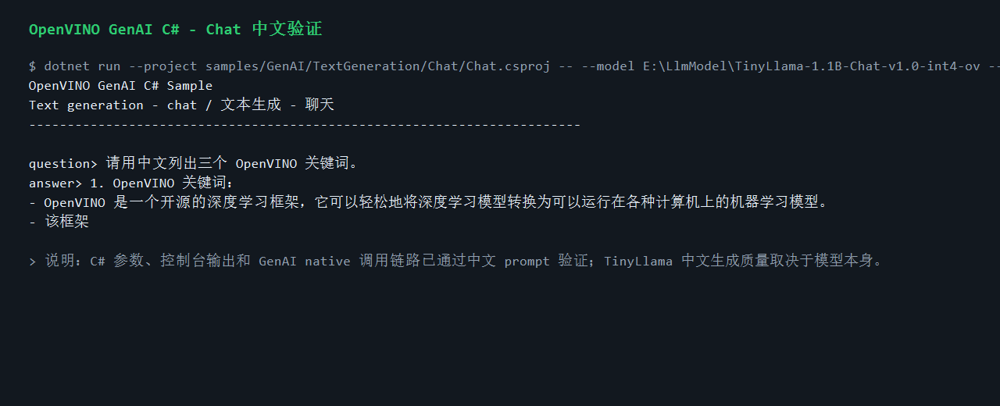
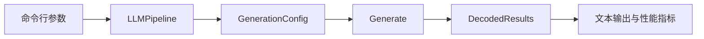

# 用 C# 跑通 OpenVINO GenAI 文本生成：从 Greedy 到流式输出

OpenVINO C# API 3.3 把 OpenVINO GenAI 的文本生成能力带到了 .NET 应用里。开发者不需要在 C# 项目中嵌入 Python 服务，也不需要手写一层 native interop，只要安装 API 包和对应平台的 GenAI runtime 包，就可以直接创建 `LLMPipeline`、配置生成参数，并在控制台、桌面程序或服务端应用中调用本地大模型。

本文以 `samples/GenAI/TextGeneration` 为入口，演示 TinyLlama OpenVINO INT4 模型在 C# 中的几种典型解码方式：稳定的 Greedy、确定性的 Beam Search、带随机性的 Multinomial Sampling、逐 token 输出的 Streaming，以及多轮 Chat 和 Benchmark。

## 为什么值得关注

OpenVINO GenAI 的价值在于把模型转换、图优化、推理执行和生成式 AI pipeline 串在一起。对 .NET 开发者来说，OpenVINO C# API 3.3 进一步补齐了最后一段：应用代码可以继续写 C#，模型运行在本机 CPU、GPU 或其他 OpenVINO 设备上，部署时通过 NuGet 管理托管 API 和 native runtime。

这套示例覆盖了文本生成应用最常见的几个问题：

- 如何用最少代码跑通一个本地 LLM。
- 如何在稳定输出和多样化输出之间切换。
- 如何把流式 token 回调接到 UI 或命令行。
- 如何测量首 token 延迟、生成耗时和吞吐。
- 如何让 GenAI runtime 只在使用 GenAI API 时加载，不影响传统 OpenVINO 推理项目。

## 示例目录

```text
samples/GenAI/TextGeneration/
  Greedy/
  BeamSearch/
  Multinomial/
  Streaming/
  Chat/
  Benchmark/
```

`Greedy` 适合做 smoke test；`BeamSearch` 适合需要确定性搜索的任务；`Multinomial` 用于更开放的创作类输出；`Streaming` 展示 token 到达即输出；`Chat` 提供交互式和 scripted turns 两种对话入口；`Benchmark` 用于快速观察生成性能。

## 准备模型和运行环境

从仓库根目录执行：

```powershell
cd E:\GitSpace\OpenVINO-CSharp-API-csharp3.3\OpenVINO-CSharp-API

$modelRoot = "E:\LlmModel"
$llm = Join-Path $modelRoot "TinyLlama-1.1B-Chat-v1.0-int4-ov"
```

下载 OpenVINO 格式模型：

```powershell
conda run -n PaddleOCR hf download OpenVINO/TinyLlama-1.1B-Chat-v1.0-int4-ov --local-dir $llm
```

这里使用 `PaddleOCR` 是本机已安装 `hf` / `huggingface-cli` 的 conda 环境名；如果你的 Hugging Face CLI 在其他 conda 环境中，把 `PaddleOCR` 替换为对应环境名即可。

示例项目会在 Windows 上通过 NuGet 恢复 `JYPPX.OpenVINO.GenAI.runtime.win`。如果你已经在本机编译了 OpenVINO GenAI native runtime，也可以通过 `OPENVINO_GENAI_RUNTIME_DIR` 指向本地 runtime，但普通用户不需要这么做。

## 跑通 Greedy 生成

```powershell
dotnet run --project samples/GenAI/TextGeneration/Greedy/Greedy.csproj --framework net8.0 -- `
  --model $llm `
  --device CPU `
  --prompt "What is OpenVINO?" `
  --max-new-tokens 64
```

运行后可以看到模型路径、设备、prompt、生成文本和性能指标。一次典型输出如下：

```text
Model: E:\LlmModel\TinyLlama-1.1B-Chat-v1.0-int4-ov
Device: CPU
Prompt: What is OpenVINO?

Generated text:
OpenVINO is an open-source toolkit for optimizing and deploying AI inference.
```

中文 Chat 验证截图如下，截图内容来自本仓库 `samples/GenAI/RunAllSamples.ps1` 的实际运行日志：



示例核心代码很短：

```csharp
using GenerationConfig config = GenAISample.CreateTextConfig(maxNewTokens);
using LLMPipeline pipeline = new(model, device);
using DecodedResults results = pipeline.Generate(prompt, config);

Console.WriteLine(results.GetText());
```

这段代码背后的关键点是生命周期管理。`LLMPipeline`、`GenerationConfig` 和 `DecodedResults` 都持有 native 资源，示例使用 `using` 让资源释放路径清晰可见。

## 实现教程：写一个可复用的文本生成入口

第一步，解析命令行参数。示例统一使用 `SampleOptions.Parse(args)` 处理 `--model`、`--device`、`--prompt`、`--max-new-tokens` 等参数，并通过环境变量兜底模型路径。这样同一个示例既能在本机手动运行，也能放进 CI 或验证脚本中运行。

```csharp
SampleOptions options = SampleOptions.Parse(args);
string model = GenAISample.RequireModelDirectory(
    options.Require("model", "OPENVINO_GENAI_LLM_MODEL_DIR"));
string device = options.Get("device", "CPU", "OPENVINO_GENAI_DEVICE")!;
ulong maxNewTokens = options.GetUInt64("max-new-tokens", 96);
```

第二步，创建生成配置。`GenAISample.CreateTextConfig(maxNewTokens)` 会设置最大生成 token 数，具体示例再根据策略追加 beam、temperature、top-p、top-k 或 stop strings。这样每个示例只展示自己关心的生成策略，不重复写样板代码。

```csharp
using GenerationConfig config = GenAISample.CreateTextConfig(maxNewTokens);
```

第三步，创建 `LLMPipeline` 并执行生成。`model` 指向 OpenVINO GenAI 模型目录，`device` 可以是 `CPU` 或其他 OpenVINO 设备。调用结束后从 `DecodedResults.GetText()` 取出最终文本。

```csharp
using LLMPipeline pipeline = new(model, device);
using DecodedResults results = pipeline.Generate(prompt, config);
Console.WriteLine(results.GetText());
```

第四步，给 Chat 增加可自动化的对话轮次。交互式 `Console.ReadLine()` 适合真人测试，但文章、CI 和中文验证更适合使用可重复的 `--turn` 参数。当前 Chat 示例支持多次传入 `--turn`，每一轮都会写入历史列表并调用同一个 pipeline。

```powershell
dotnet run --project samples/GenAI/TextGeneration/Chat/Chat.csproj --framework net8.0 -- `
  --model $llm `
  --device CPU `
  --max-new-tokens 96 `
  --turn "请用中文列出三个 OpenVINO 关键词。"
```

第五步，处理中文控制台。公共入口会把控制台输出设置为 UTF-8；脚本化中文输入走命令行参数，避免 Windows PowerShell 管道在不同编码设置下把中文转换成问号。实测中 C# 参数、控制台输出和 native GenAI 调用链路可以正确传递中文。

## 对比几种生成策略

Beam Search 使用多个候选路径搜索更稳定的结果：

```powershell
dotnet run --project samples/GenAI/TextGeneration/BeamSearch/BeamSearch.csproj --framework net8.0 -- `
  --model $llm `
  --device CPU `
  --prompt "OpenVINO is" `
  --beams 4 `
  --max-new-tokens 64
```

Multinomial Sampling 通过 temperature、top-p、top-k 调整随机性：

```powershell
dotnet run --project samples/GenAI/TextGeneration/Multinomial/Multinomial.csproj --framework net8.0 -- `
  --model $llm `
  --device CPU `
  --prompt "OpenVINO helps developers" `
  --temperature 0.8 `
  --top-p 0.95 `
  --top-k 50 `
  --max-new-tokens 64
```

Streaming 适合聊天窗口、命令行助手和长文本生成：

```powershell
dotnet run --project samples/GenAI/TextGeneration/Streaming/Streaming.csproj --framework net8.0 -- `
  --model $llm `
  --device CPU `
  --prompt "List three OpenVINO benefits." `
  --max-new-tokens 96
```

流式示例把 native 侧生成出的 token 逐步回调到 C#，用户不必等完整结果结束才看到内容。这对于交互式产品非常重要，因为首 token 延迟比总耗时更直接影响体验。

## Chat 和 Benchmark

聊天示例支持真实终端交互，也支持用 `--turn` 传入多轮 scripted 对话，后者更适合 CI、文章复现和中文 prompt 验证：

```powershell
dotnet run --project samples/GenAI/TextGeneration/Chat/Chat.csproj --framework net8.0 -- `
  --model $llm `
  --device CPU `
  --max-new-tokens 96 `
  --turn "OpenVINO 适合部署在哪些设备上？请用中文回答。" `
  --turn "请用中文列出三个 OpenVINO 关键词。"
```

实验中 C# 侧 UTF-8 参数传递、控制台输出和 OpenVINO GenAI native 调用均可处理中文。需要注意的是，中文回答质量取决于模型本身。`TinyLlama-1.1B-Chat-v1.0-int4-ov` 可以作为轻量 smoke test，但中文知识和语言稳定性有限；正式中文对话建议换成 Qwen、InternVL 等中文或多语能力更强的 OpenVINO 模型。

Benchmark 示例：

```powershell
dotnet run --project samples/GenAI/TextGeneration/Benchmark/Benchmark.csproj --framework net8.0 -- `
  --model $llm `
  --device CPU `
  --prompt "OpenVINO is" `
  --iterations 3 `
  --warmup 1 `
  --max-new-tokens 64
```

Benchmark 会先执行 warmup，再记录正式迭代的生成耗时。它不是完整的硬件评测工具，但足够帮助开发者判断模型、设备和生成参数是否适合当前应用。

## 参数速查

| 参数 | 说明 |
|---|---|
| `--model` | OpenVINO GenAI 模型目录 |
| `--device` | OpenVINO 设备，例如 `CPU` |
| `--prompt` | 输入提示词 |
| `--max-new-tokens` | 最大生成 token 数 |
| `--beams` | Beam Search 候选数量 |
| `--temperature` | 采样温度，值越高越发散 |
| `--top-p` | nucleus sampling 阈值 |
| `--top-k` | top-k 采样数量 |
| `--iterations` | Benchmark 正式迭代次数 |
| `--warmup` | Benchmark 预热次数 |
| `--turn` | Chat 示例的 scripted 对话轮次，可重复传入 |
| `--system-prompt` | Chat 示例的可选额外指令 |

## 技术流程



## 排错

模型加载失败时，先确认模型目录中包含 `openvino_model.xml`、`openvino_model.bin`、tokenizer 和 detokenizer 文件。runtime 加载失败时，确认项目已经恢复 `JYPPX.OpenVINO.GenAI.runtime.win`，或本地 `OPENVINO_GENAI_RUNTIME_DIR` 指向的是包含 `openvino_genai_c.dll`、`openvino.dll`、插件和依赖库的完整 runtime 目录。

中文输入在命令行参数中更稳定；PowerShell 管道输入在不同终端编码下可能把中文 `Console.ReadLine()` 内容转换成问号。自动化验证建议使用 `--turn "中文问题"`，真实交互终端则直接输入中文即可。

第一次生成速度较慢通常是正常现象，模型编译、缓存初始化和 CPU warmup 都会集中发生在首次调用。正式应用中可以在服务启动阶段做一次短 prompt 预热。

## 小结

`samples/GenAI/TextGeneration` 展示了 OpenVINO C# API 3.3 对 LLM 文本生成的完整托管调用路径。从最简单的 Greedy 到流式输出和 Benchmark，开发者可以直接把这些模式迁移到自己的 .NET 应用中。更重要的是，GenAI runtime 是可选依赖：传统 OpenVINO 推理代码不需要加载 GenAI native 库，只有调用 `OpenVinoSharp.GenAI` 时才进入这条路径。
