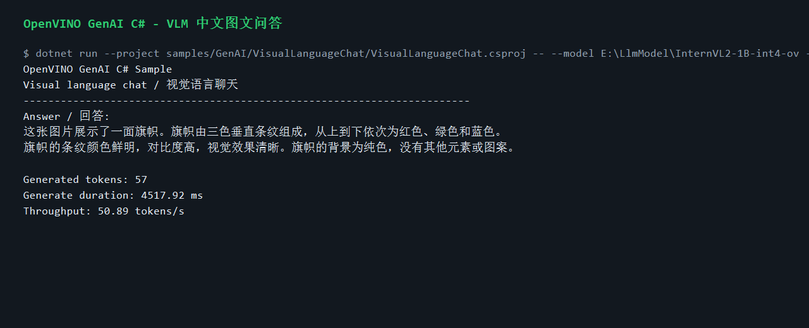
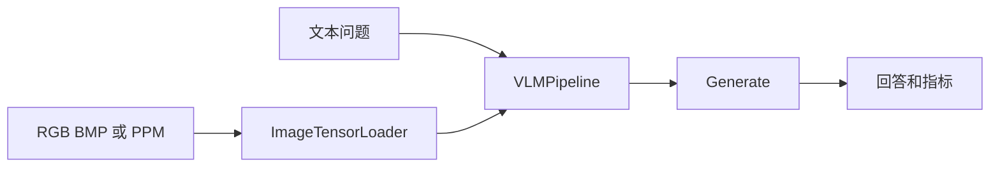

# 用 C# 构建 OpenVINO GenAI 视觉语言问答

视觉语言模型让应用可以同时理解图片和文本问题。OpenVINO C# API 3.3 在 `OpenVinoSharp.GenAI` 中加入 VLM pipeline 封装后，.NET 应用可以直接把图片加载为 Tensor，再把图片和 prompt 一起送入 OpenVINO GenAI。

本文以 `samples/GenAI/VisualLanguageChat` 为例，展示如何用 C# 跑通本地图文问答和交互式聊天。这个示例适合扩展成离线图片问答、设备巡检说明、文档截图理解、工业图像辅助分析等应用。

## 示例位置

```text
samples/GenAI/VisualLanguageChat/
  VisualLanguageChat.csproj
  Program.cs
  README.md
```

图片加载器位于：

```text
samples/GenAI/Common/ImageTensorLoader.cs
```

示例内置的图片加载器支持 RGB BMP 和二进制 PPM/PNM。这样做是为了让示例不额外依赖图片处理 NuGet 包，便于用户直接阅读和移植。

## 准备模型和图片

从仓库根目录执行：

```powershell
cd E:\GitSpace\OpenVINO-CSharp-API-csharp3.3\OpenVINO-CSharp-API

$modelRoot = "E:\LlmModel"
$vlm = Join-Path $modelRoot "InternVL2-1B-int4-ov"
$image = Join-Path $modelRoot "assets\color_blocks_30.ppm"
```

下载模型：

```powershell
conda run -n PaddleOCR hf download OpenVINO/InternVL2-1B-int4-ov --local-dir $vlm
```

这里使用 `PaddleOCR` 是本机已安装 `hf` / `huggingface-cli` 的 conda 环境名；如果你的 Hugging Face CLI 在其他 conda 环境中，把 `PaddleOCR` 替换为对应环境名即可。

如果你手头是 JPG 或 PNG，可以先转成 RGB BMP：

```powershell
python -c "from PIL import Image; Image.open(r'input.jpg').convert('RGB').save(r'input.bmp')"
$image = Join-Path $PWD "input.bmp"
```

本文使用的验证图片是三色 PPM 色块图，用来稳定验证图片解码、Tensor 构造、VLM prompt 和中文输出链路。业务演示时可以把 `$image` 替换成仪表盘、产品照片、场景照片或截图，命令和 C# 代码保持不变。

## 单轮图文问答

```powershell
dotnet run --project samples/GenAI/VisualLanguageChat/VisualLanguageChat.csproj --framework net8.0 -- `
  --model $vlm `
  --image $image `
  --device CPU `
  --prompt "请用中文描述这张图片。" `
  --max-new-tokens 96
```

典型输出会包含模型回答和性能指标：

```text
Answer:
这张图片展示了一面旗帜。旗帜由三色垂直条纹组成，从上到下依次为红色、绿色和蓝色。

Performance metrics:
  Generated tokens: 57
```

输出内容会随模型、图片和 prompt 变化。实际验证中，`InternVL2-1B-int4-ov` 可以直接处理中文 VLM prompt，并返回中文描述。对于视觉语言任务，prompt 越具体，结果越容易评估。例如“列出图片中的颜色”“判断屏幕上是否有错误提示”“描述图中设备状态”通常比宽泛的“这是什么”更适合工程验证。

本机实际运行截图如下：



## 交互式聊天

```powershell
dotnet run --project samples/GenAI/VisualLanguageChat/VisualLanguageChat.csproj --framework net8.0 -- `
  --model $vlm `
  --image $image `
  --device CPU `
  --interactive true `
  --max-new-tokens 96
```

进入交互模式后，可以连续输入关于同一张图片的问题。输入空行或 `/exit` 退出。

## 实现教程：把图片和问题送入 VLM

```csharp
using Tensor imageTensor = ImageTensorLoader.LoadRgbTensor(image);
using GenerationConfig config = GenAISample.CreateTextConfig(maxNewTokens);
using VLMPipeline pipeline = new(model, device);

using VLMDecodedResults results = pipeline.Generate(
    prompt,
    new[] { imageTensor },
    config);

Console.WriteLine(results.GetText());
```

这段代码的关键是图片 Tensor 的生命周期。`ImageTensorLoader` 把 RGB 图片转换为 OpenVINO Tensor，`VLMPipeline.Generate` 在调用期间借用这个 Tensor，因此调用结束前不能释放图片 Tensor。

第一步，加载图片。`ImageTensorLoader.LoadRgbTensor(image)` 会读取 RGB BMP 或二进制 PPM/PNM，解析宽高和像素数据，然后创建 OpenVINO `Tensor`。示例刻意没有引入额外图片库，因此 JPG、PNG、WebP 需要先转换为 RGB BMP。

第二步，创建生成配置。VLM 的文本输出仍然使用 `GenerationConfig` 控制最大 token 数、停止条件和流式输出等生成参数。单轮问答通常从 `--max-new-tokens 96` 开始调试，业务场景再根据输出长度增加或减少。

```csharp
using GenerationConfig config = GenAISample.CreateTextConfig(maxNewTokens);
```

第三步，创建 `VLMPipeline`。模型目录需要包含视觉语言模型的 OpenVINO IR、tokenizer、detokenizer 和模型配置文件。设备参数沿用 OpenVINO 约定，本次验证使用 `CPU`。

```csharp
using VLMPipeline pipeline = new(model, device);
```

第四步，调用 `Generate`。prompt 负责描述任务，图片 Tensor 数组负责传递视觉输入。当前示例是一张图片，因此传入 `new[] { imageTensor }`。

```csharp
using VLMDecodedResults results = pipeline.Generate(
    prompt,
    new[] { imageTensor },
    config);
```

第五步，处理回答和指标。示例会输出 `results.GetText()`，并打印首 token 延迟、生成耗时、吞吐等指标。工程应用可以把回答写入 UI、结构化日志或审核流程；如果要连续问同一张图片，可以启用 `--interactive true`，在应用层维护用户输入。

## 技术流程



## Runtime 兼容说明

OpenVINO GenAI 2026.3 Windows C runtime 已导出 `ov_genai_vlm_pipeline_generate_with_history`。因此 C# 示例使用 `ChatHistory` 加 `GenerateWithHistory()` 的方式实现交互流程，不再依赖已弃用的 `StartChat()`/`FinishChat()`。

这不影响单轮 VLM 生成，也不影响把示例扩展成应用。应用层可以维护自己的历史记录，并按模型支持的上下文方式组织 prompt。

## 参数速查

| 参数 | 说明 |
|---|---|
| `--model` | VLM OpenVINO 模型目录 |
| `--image` | RGB BMP、PPM 或 PNM 图片路径 |
| `--device` | OpenVINO 设备，例如 `CPU` |
| `--prompt` | 关于图片的问题 |
| `--interactive` | 是否进入交互式问答 |
| `--stream` | 是否流式输出生成文本 |
| `--allow-empty` | 仅用于 ABI smoke test 的空输出放行 |
| `--max-new-tokens` | 最大生成 token 数 |

## 排错

图片加载失败时，先确认图片是 RGB BMP 或二进制 PPM/PNM。JPG、PNG、WebP 等格式可以先用 Pillow 转换。模型加载失败时，确认目录中包含 OpenVINO IR、tokenizer、detokenizer 和模型配置文件。

如果输出不符合预期，优先换一张语义明确的真实图片，再把 prompt 写得更具体。tiny random VLM 模型只适合 ABI smoke test，不能用来评估视觉理解效果。

## 小结

VLM 示例展示了 OpenVINO C# API 3.3 对多模态能力的托管封装路径：C# 负责读取图片、组织 prompt 和处理输出，OpenVINO GenAI 负责执行视觉语言模型。它让 .NET 应用可以在不引入 Python 服务的情况下获得本地图文问答能力，是 GenAI 在桌面、工业和边缘场景落地的重要一块。
