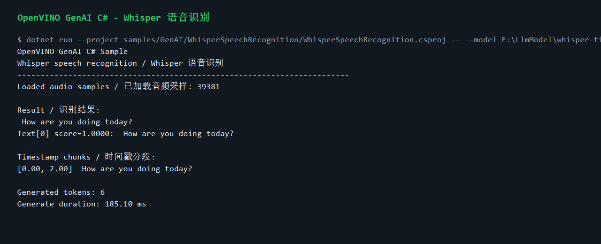
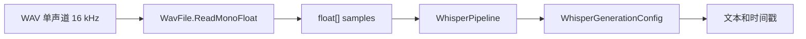

# 用 C# 调用 OpenVINO GenAI Whisper：本地语音识别与时间戳

OpenVINO C# API 3.3 新增的 `OpenVinoSharp.GenAI` 命名空间不仅覆盖文本生成，也提供了 Whisper 语音识别 pipeline 的托管封装。本文演示如何用 C# 加载 OpenVINO 格式 Whisper 模型，读取 16 kHz 单声道 WAV，并输出识别文本和时间戳片段。

这个示例适合做离线语音识别、会议记录预处理、桌面工具语音输入、工业现场离线转写等场景的起点。它的特点是部署链路清晰：C# 应用负责业务逻辑，OpenVINO GenAI runtime 负责 native 推理，模型和 runtime 都可以通过 NuGet 与本地文件系统管理。

## 示例位置

```text
samples/GenAI/WhisperSpeechRecognition/
  WhisperSpeechRecognition.csproj
  Program.cs
  README.md
```

公共 WAV 读取逻辑位于：

```text
samples/GenAI/Common/WavFile.cs
```

示例只接受 PCM WAV，并在读取时转换为 `float[]` 传给 `WhisperPipeline`。

## 准备模型和音频

从仓库根目录执行：

```powershell
cd E:\GitSpace\OpenVINO-CSharp-API-csharp3.3\OpenVINO-CSharp-API

$modelRoot = "E:\LlmModel"
$whisper = Join-Path $modelRoot "whisper-tiny-int8-ov"
$audio = Join-Path $modelRoot "assets\how_are_you_doing_today.wav"
New-Item -ItemType Directory -Force (Split-Path $audio) | Out-Null
```

下载 Whisper OpenVINO 模型：

```powershell
conda run -n PaddleOCR hf download OpenVINO/whisper-tiny-int8-ov --local-dir $whisper
```

这里使用 `PaddleOCR` 是本机已安装 `hf` / `huggingface-cli` 的 conda 环境名；如果你的 Hugging Face CLI 在其他 conda 环境中，把 `PaddleOCR` 替换为对应环境名即可。

下载示例音频：

```powershell
curl.exe -L -o $audio https://storage.openvinotoolkit.org/models_contrib/speech/2021.2/librispeech_s5/how_are_you_doing_today.wav
```

如果使用自己的音频，先转换为 16 kHz 单声道 WAV：

```powershell
ffmpeg -i input.mp3 -ac 1 -ar 16000 speech.wav
```

## 运行识别

```powershell
dotnet run --project samples/GenAI/WhisperSpeechRecognition/WhisperSpeechRecognition.csproj --framework net8.0 -- `
  --model $whisper `
  --audio $audio `
  --device CPU `
  --language en `
  --task transcribe `
  --timestamps true
```

典型输出：

```text
Result:
 How are you doing today?

Timestamp chunks:
[0.00, 2.00] How are you doing today?
```

实际运行截图如下，识别音频为 `how_are_you_doing_today.wav`：



`--language en` 会在示例内部转换为 Whisper token 形式 `<|en|>`。如果你已经熟悉 Whisper 原生参数，也可以直接传入 `<|en|>`。

## 实现教程：从 WAV 到识别文本

```csharp
float[] samples = WavFile.ReadMonoFloat(audio, 16000);

using WhisperPipeline pipeline = new(model, device);
using WhisperGenerationConfig config = pipeline.GetGenerationConfig();

config.SetLanguage("<|en|>");
config.SetTask("transcribe");
config.SetReturnTimestamps(true);

using WhisperDecodedResults results = pipeline.Generate(samples, config);
Console.WriteLine(results.GetString());
```

这段代码把语音识别拆成三步：读取音频、配置 Whisper 生成参数、调用 pipeline。`WhisperDecodedResults` 除了完整文本，还可以返回分段时间戳，便于后续做字幕、切片或检索。

第一步，读取音频。示例使用 `WavFile.ReadMonoFloat(audio, 16000)` 读取 PCM WAV，并把单声道采样转换为 `float[]`。Whisper pipeline 期望稳定的采样率输入，因此示例把目标采样率固定为 16 kHz；如果你的来源是 MP3、AAC 或双声道音频，应先用 FFmpeg 转码。

第二步，创建 pipeline。`WhisperPipeline` 的构造参数与文本生成保持一致：模型目录和 OpenVINO 设备。模型目录中需要包含 OpenVINO IR、tokenizer、decoder、encoder 等 Whisper 所需文件。

```csharp
using WhisperPipeline pipeline = new(model, device);
```

第三步，读取并修改默认生成配置。示例从 pipeline 获取 `WhisperGenerationConfig`，然后设置语言、任务和时间戳开关。语言参数支持 `en` 这种简写，示例会转换成 Whisper 使用的 `<|en|>` token。

```csharp
using WhisperGenerationConfig config = pipeline.GetGenerationConfig();
config.SetLanguage("<|en|>");
config.SetTask("transcribe");
config.SetReturnTimestamps(true);
```

第四步，执行识别并读取结果。`Generate(samples, config)` 返回 `WhisperDecodedResults`。完整文本可以用 `GetString()` 读取；开启 timestamps 后，示例还会枚举 chunk，把 `[start, end] text` 输出到控制台。

```csharp
using WhisperDecodedResults results = pipeline.Generate(samples, config);
Console.WriteLine(results.GetString());
```

第五步，接入业务应用。桌面语音输入可以直接把 `GetString()` 的结果放进文本框；字幕或会议纪要应用应使用时间戳 chunk 作为后处理入口；批处理服务可以把音频预处理、模型调用和结果保存拆成独立阶段，便于失败重试。

## 技术流程



## 参数速查

| 参数 | 说明 |
|---|---|
| `--model` | Whisper OpenVINO 模型目录 |
| `--audio` | 16 kHz 单声道 WAV 路径 |
| `--device` | OpenVINO 设备，例如 `CPU` |
| `--language` | 语言代码，例如 `en` |
| `--task` | Whisper 任务，例如 `transcribe` |
| `--timestamps` | 是否输出时间戳片段 |
| `--initial-prompt` | 可选初始提示词 |
| `--hotwords` | 可选热词 |

## 工程化建议

在实际应用中，建议把音频预处理放在独立模块中，统一转换采样率、声道数和格式。对于长音频，可以先按静音或固定窗口切片，再把每段送入 Whisper pipeline。这样更容易控制内存、响应时间和错误恢复。

如果需要批量处理多个文件，可以复用模型目录和设备配置，但不要在多个线程随意共享同一个 native pipeline 对象。更稳妥的方式是按任务创建 pipeline，或在应用层做串行队列和资源池。

## 排错

如果输出为空，先确认 WAV 文件确实包含清晰语音，并且是 16 kHz 单声道 PCM。语言参数错误时，使用 `--language en` 这种普通语言代码即可，示例会自动转换。timestamp 未输出时，确认运行命令带了 `--timestamps true`，并检查当前模型和 runtime 是否返回 chunk metadata。

runtime 加载失败时，确认项目已经安装 `JYPPX.OpenVINO.GenAI.runtime.win`，或 `OPENVINO_GENAI_RUNTIME_DIR` 指向完整 native runtime。

## 小结

Whisper 示例说明 OpenVINO C# API 3.3 不只是“能跑 LLM”，也可以把语音识别这类 GenAI pipeline 纳入 .NET 应用。C# 侧代码保持简单，模型推理由 OpenVINO GenAI 执行，最终形成一个可离线、可部署、可集成的语音识别方案。
